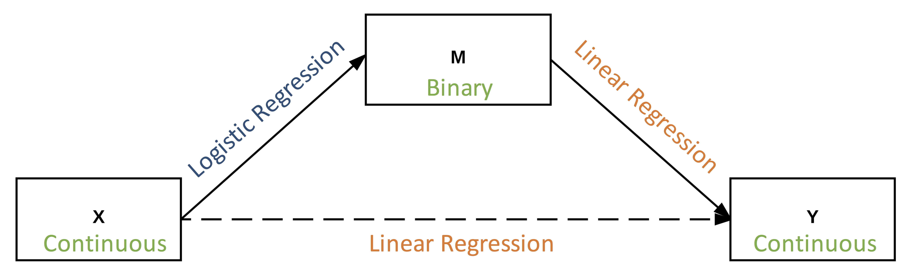
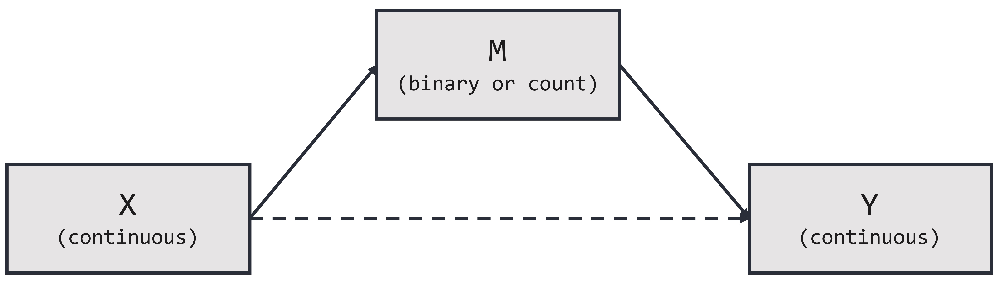
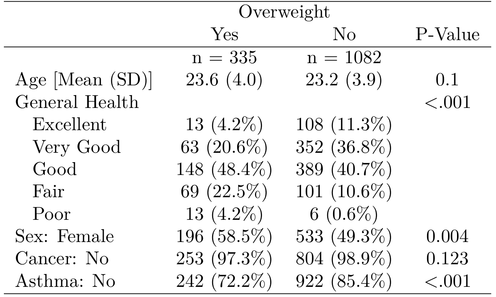
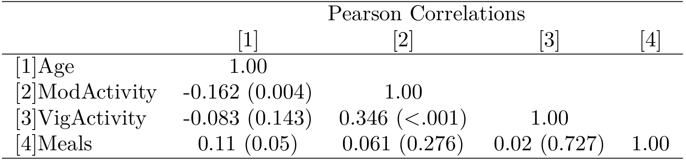

```{r setup, include=FALSE}
options(htmltools.dir.version = FALSE)
```

class: inverse, middle, center

# Any fool can know. The point is to understand.
### -- Albert Einstein --

---
class: inverse, middle, center

# The problem with quotes found on the internet is that they are often not true. 
### -- Abraham Lincoln --

---
background-image: url(fig_hds.jpg)
background-position: 50% 80%
background-size: 500px

# Health Data Science


---
# Health Data Science

.pull-left[
.huge[
- .nicegreen[Pragmatic solutions] to research problems

- Involves both .dcoral[methods and software]
]]

.pull-right[
.huge[
- Focus is on .bluer[reproducibility and interpretability]

- Uses interdisciplinary approaches to .nicegreen[extract actionable information]
]]

---
class: inverse, middle, center

# What I've Done So Far <br><br> in Health Data Science

---
# What I've Done So Far

<br>

.pull-left[.huge[
Provided .nicegreen[methods and tools] for prevention researchers
]]

--

.pull-right[.huge[
Applied these tools to .dcoral[adolescent health research]
]]


---
class: inverse, center, middle
# Providing Methods and Tools

---
# Providing Methods and Tools

.huge[Two major aspects:]

.dcoral[
.pull-left[.center[
### Developing New Methods/Approaches

.large[Methods to make research more reproducible and interpretable]
]]]

--
.nicegreen[
.pull-right[.center[
### Creating Software in `R`

.pull-left[.large[
Provides the ability to use new methods
]]

.pull-right[.large[
Makes understanding data easier and less error-prone
]]]]]

---
# Developing New Methods/Approaches

--
.Huge[.dcoral[**Marginal Mediation Analysis**]]

<br>

--
.large[.large[
This is a synthesis of two powerful approaches:

1. .bluer[Mediation Analysis]

2. .nicegreen[Average Marginal Effects]
]]


---
# What is Mediation Analysis

.pull-left[
.huge[
A series of regressions:]

$$
Y = c_0 + b_1 M + c'_1 X + e_1
$$

$$
M = a_0 + a_1 X + e_2
$$

.center[.huge[.huge[👉]]]
]

.pull-right[
```{r, echo=FALSE, message=FALSE, warning=FALSE, fig.align='center', fig.height=4, fig.width=6}
library(lavaan)
library(tidyverse)

# Example 5.8 from mplus user guide:
Data <- data.frame(
  Y = rnorm(100),
  X = rnorm(100),
  M = rnorm(100)
)

# Model:
model.Lavaan <- '
  M ~ X
  Y ~ M + X
'
fit <- cfa(model.Lavaan, data=Data, std.lv=TRUE)

# Plot path diagram:
library(semPlot)
semPaths(fit,
         title=FALSE, curvePivot = TRUE,
         edgeLabels = c("a", "b", "c'"),
         edge.label.cex = 2,
         layout = "spring",
         sizeMan = 12,
         shapeMan = "rectangle",
         border.color = "dodgerblue4",
         border.width = 3,
         node.width = 1.5,
         node.height = 1,
         mar = c(4,6,5,6))
```
]

--

$$
\text{Indirect Effect} = a \times b
$$

--

$$
\text{Direct Effect} = c'
$$

--

$$
\text{Total Effect} = a \times b + c' = c
$$


---
# But...

.large[.large[
Mediator or outcome is **categorical/non-normal**:

- Lacks intuitive interpretation (e.g., total effect doesn't equal total effect?)
- No defined effect sizes (indirect or total) or meaningful confidence intervals
]]

---
count: false
# But...

.large[.large[
Mediator or outcome is **categorical/non-normal**:]]



???
  - Mediation struggles with categorical/non-normal mediators/outcomes
  - For example, 
    - if X is continuous, M is binary, and Y is continuous the diagram shows how we would often model each path
    - So, how do you create a meaningful effect size when trying to combine logistic and linear regression?
  - Ultimately, to have any meaningful interpretation, **need additive**

So its not good. But to reiterate, consider the next slide.

---
# Why the big fuss?

.pull-left[
#### Linear Model

$$
Y = \beta_0 + \sum_j^p \beta_j X_j + e_i
$$

.large[The marginal effect of, say,] $X_1$ .large[is:]
$$
\frac{\delta Y}{\delta X_1} = \beta_1
$$
]

--

.pull-right[

#### Logistic Regression

$$
logit(Y) = \beta_0 + \sum_j^p \beta_j X_j + e_i
$$

$$
Prob(Y = 1) = \frac{e^{\beta_0 + \sum_j^p \beta_j X_j + e_i}}{1 + e^{\beta_0 + \sum_j^p \beta_j X_j + e_i}}
$$

.large[The marginal effect of, say,] $X_1$ .large[is:]
$$
\frac{\delta Y}{\delta X_1} = \frac{e^{\beta_0 + \sum_j^p \beta_j X_j + e_i}}{(1 + e^{\beta_0 + \sum_j^p \beta_j X_j + e_i})^2}
$$
]

???
  - Consider the *marginal effect* -- the thing you want in regression -- in two situations (**feel free to ignore the math**)
    - Linear
    - Logistic
      - In logistic the marginal effect depends on the values of all the predictors 
      - and it is just plain ugly compared to linear regression

The takeaway --> Marginal Effect depends on all covariates

Ultimately, mediation doesn't work well with categorical mediators/outcomes. But people are using those, right? So what are the common approaches?

---

# Current Approaches

```{r, echo=FALSE, message=FALSE, warning=FALSE}
data.frame(
  Number = 1:4,
  Approach = c("Use SEM's approach (polychoric correlation)",
               "Standardize the coefficients",
               "Interpret each path separately",
               "Pretend all variables are continuous"),
  Pros = c("Powerful, well-designed,\nEasy to implement with proper software", 
           "Provides significance test\nof indirect effect",
           "Simplest approach with proper models",
           "Simplest approach"),
  Cons = c("Only works with ordinal variables,\n only standardized effect sizes",
           "Assumptions (distributions), difficult to interpret beyond p-value",
           "Ignores some information,\n cannot obtain indirect effect size",
           "Purposeful mis-specification, poor model fit")
) %>%
  DT::datatable(options = list(dom = "t"),
                rownames = FALSE) %>%
  DT::formatStyle(c("Number"),
                  target = "row",
                  color = DT::styleEqual(c("1", 
                                           "2", 
                                           "3", 
                                           "4"), 
                                         c("black", "white", "white", "white")))
```

---
count: false

# Current Approaches

```{r, echo=FALSE, message=FALSE, warning=FALSE}
data.frame(
  Number = 1:4,
  Approach = c("Use SEM's approach (polychoric correlation)",
               "Standardize the coefficients",
               "Interpret each path separately",
               "Pretend all variables are continuous"),
  Pros = c("Powerful, well-designed,\nEasy to implement with proper software", 
           "Provides significance test\nof indirect effect",
           "Simplest approach with proper models",
           "Simplest approach"),
  Cons = c("Only works with ordinal variables,\n only standardized effect sizes",
           "Assumptions (distributions), difficult to interpret beyond p-value",
           "Ignores some information,\n cannot obtain indirect effect size",
           "Purposeful mis-specification, poor model fit")
) %>%
  DT::datatable(options = list(dom = "t"),
                rownames = FALSE) %>%
  DT::formatStyle(c("Number"),
                  target = "row",
                  color = DT::styleEqual(c("1", 
                                           "2", 
                                           "3", 
                                           "4"), 
                                         c("black", "black", "white", "white")))
```

---
count: false

# Current Approaches

```{r, echo=FALSE, message=FALSE, warning=FALSE}
data.frame(
  Number = 1:4,
  Approach = c("Use SEM's approach (polychoric correlation)",
               "Standardize the coefficients",
               "Interpret each path separately",
               "Pretend all variables are continuous"),
  Pros = c("Powerful, well-designed,\nEasy to implement with proper software", 
           "Provides significance test\nof indirect effect",
           "Simplest approach with proper models",
           "Simplest approach"),
  Cons = c("Only works with ordinal variables,\n only standardized effect sizes",
           "Assumptions (distributions), difficult to interpret beyond p-value",
           "Ignores some information,\n cannot obtain indirect effect size",
           "Purposeful mis-specification, poor model fit")
) %>%
  DT::datatable(options = list(dom = "t"),
                rownames = FALSE) %>%
  DT::formatStyle(c("Number"),
                  target = "row",
                  color = DT::styleEqual(c("1", 
                                           "2", 
                                           "3", 
                                           "4"), 
                                         c("black", "black", "black", "white")))
```

---
count: false

# Current Approaches

```{r, echo=FALSE, message=FALSE, warning=FALSE}
data.frame(
  Number = 1:4,
  Approach = c("Use SEM's approach (polychoric correlation)",
               "Standardize the coefficients",
               "Interpret each path separately",
               "Pretend all variables are continuous"),
  Pros = c("Powerful, well-designed,\nEasy to implement with proper software", 
           "Provides significance test\nof indirect effect",
           "Simplest approach with proper models",
           "Simplest approach"),
  Cons = c("Only works with ordinal variables,\n only standardized effect sizes",
           "Assumptions (distributions), difficult to interpret beyond p-value",
           "Ignores some information,\n cannot obtain indirect effect size",
           "Purposeful mis-specification, poor model fit")
) %>%
  DT::datatable(options = list(dom = "t"),
                rownames = FALSE) %>%
  DT::formatStyle(c("Number"),
                  target = "row",
                  color = DT::styleEqual(c("1", 
                                           "2", 
                                           "3", 
                                           "4"), 
                                         c("black", "black", "black", "black")))
```


---
# A Better Approach
## Use Average Marginal Effects

.huge[.dcoral[Background:]]

$$
\text{Marginal Effect (Logistic)} = \frac{e^{\beta_0 + \sum_j^p \beta_j X_j + e_i}}{(1 + e^{\beta_0 + \sum_j^p \beta_j X_j + e_i})^2}
$$

--

.large[
1. Each individual has a "marginal effect"
2. Take the *average* of the marginal effects = AME
]

--

.large[.nicegreen[Interpret GLM's just like linear regression]]

???
ie, a one unit increase in the predictor is associated with an X unit increase in the outcome

Benefits:

1. Represents the observed effects in the sample
2. Is additive (can be combined with other additive measures)
3. Is used in other two-part models (hurdle models)

---
# Average Marginal Effects

#### Definition: Continuous Variable
$$
AME_k = \frac{f(\beta_k [x_k + h] + \sum_j^p \beta_j x_j) - f(\beta_k x_k + \sum_j^p \beta_j x_j)}{h}
$$

<br>

--

#### Definition: Dummy Coded Variable
$$
AME_{k} = \frac{1}{n} \sum_i^n [ F(\beta X | x_k = 1) - F(\beta X | x_i = 0) ]
$$

???
  - Simply, they are the average of the marginal effects
    - with the observed values in place (no crazy or impossible values)
    - without diving into the math here, both are taking the average effect of a one unit increase in the $kth$ variable
  - In other words, take the predicted value at some level of the predictor, then add one to the predictor and take the prediction again. The difference is the marginal effect.
  - In a paper I'm working on right now, it shows the AME is a consistent estimator of the underlying latent effect (probability, count, etc.)

---
# Marginal Mediation Analysis

.huge[*The synthesis of Mediation and Average Marginal Effects*]

--
.large[.large[
- .bluer[Average Marginal Effects for each regression that make up the complete mediation model]]]

--

.large[.large[
- Uses .dcoral[bootstrapping] to understand uncertainty
]]

--

.large[.large[
- Created the .nicegreen[software] to perform Marginal Mediation Analysis (discussed later)]]

---
# Interpretation of Estimates

.footnote[Given the units of the estimates, meta-analytic comparisons across studies can be simplified as well.]

.pull-left[.large[
**The individual paths: the corresponding endogenous variable's original metric.**

**The indirect effect: the outcome's original metric.**

**Both the direct and total effects: the outcome's original metric.**
]]

--

.pull-right[
```{r, echo=FALSE, message=FALSE, warning=FALSE, fig.align='center', fig.height=4, fig.width=6}
library("lavaan")

# Example 5.8 from mplus user guide:
Data <- data.frame(
  Y_count = rnorm(100),
  X_continuous = rnorm(100),
  M_binary = rnorm(100)
)

# Model:
model.Lavaan <- '
  M_binary ~ X_continuous
  Y_count ~ M_binary + X_continuous
'
fit <- cfa(model.Lavaan, data=Data, std.lv=TRUE)

# Plot path diagram:
library(semPlot)
semPaths(fit,
         title=FALSE, curvePivot = TRUE,
         edgeLabels = c("AME = 0.23", "AME = 1.5", "AME = 0.5"),
         edge.label.cex = 2,
         nodeLabels = list(expression("M (binary)"), expression("Y (count)"), expression("X (continuous)")),
         layout = "spring",
         sizeMan = 14,
         shapeMan = "rectangle",
         border.color = "dodgerblue4",
         border.width = 3,
         node.width = 1.75,
         node.height = 1,
         mar = c(4,6,5,6))
```
]


???
  - One of the main advantages
  - However, given the number of combination of variable types, it is best to consider some basic interpretation principles
  - Review principles and show meaning in figure
    1. So with M being binary, the AME is a Marginal Probability or Risk
      - A one unit increase in X is associated with a .23 increase in the risk of M.
    2. In other words, it is the effect of X on Y through M (it should be in the outcomes units)
      - A one unit increase in X is associated with a `0.23 * 1.5 = 0.345` increase in the count of Y.
    3. No big surprises here since these are essentially the regression.

---
# Assumptions of the Approach

.left-column[
</br></br>
#### The same assumptions as linear models or generalized linear models hold.

</br></br></br>
.coral[#### Only additional assumption with AME:]
]

--

.right-column[
1. Correct distribution (normal in linear models)

1. Proper variance (homoskedastic in linear models)

1. Linear in parameters

1. Random sample

1. No measurement error

1. No omitted influences


### Marginal effect can be described *additively* (after accounting for all the covariates)
]

???
  - all same assumptions
  - Only additional one -- additively

To assess its power, accuracy --> performed Monte Carlo Simulation

---
class: inverse, middle, center

# Monte Carlo Simulation
# of Marginal Mediation Analysis

---
# General Model



--

.large[Note: All] $e_i$.large['s are normally distributed with] $\mu = 0$ .large[and] $\sigma = 1$

---
# Monte Carlo Simulation

## .dcoral[The "a" Path Population Model (.bluer[Binary] Mediator)]

$Prob(M^b = 1)$ .large[is a latent continuous variable where]

$$
\frac{Prob(M^b = 1)_i}{1 - Prob(M^b = 1)_i} = a_0 + a_1 x_i + e_i
$$

.large[The observed variable,] $M_i$.large[, is defined as follows:] 

$$
M_i = 0 \text{ if } Prob(M = 1) < .5
$$

$$
M_i = 1 \text{ otherwise}
$$

---
# Monte Carlo Simulation

## .dcoral[The "a" Path Population Model (.bluer[Count] Mediator)]

$M^c$ .large[is a latent count variable]

$$
M^c_i = a_0 + a_1 x_i + e_i
$$
.large[The observed variable,] $M_i$.large[, is defined as follows:] 

$$
M_i = Po(\lambda = M^c_i)
$$


---
# Monte Carlo Simulation

## .dcoral[The "b" and "c'" Path Population Model (for both the binary and count mediators)]

$$
Y_i = b_0 + b_1 M_i + c'_1 x_c + e_i
$$


???
  - The known population model consist of a binary M and continuous (approx normal) outcome
  - A path has a latent probability variable that maps onto a discrete mediator
  - B and C path is essentially a multiple linear regression

---
# Monte Carlo Simulation

.huge[.dcoral[Conditions] Varied for the simulation:]

.large[.large[
- Varying sample size (50 - 1000)
- Varying effect size of each path (small, medium, large)
- Varying Mediator's distribution (binomial, poisson)
]]

--

.large[.large[Each condition will have 500 replications]]

???
  - The conditions tested will be broad for basic understanding of the method's behavior
  - Sample size: basic for what is needed for logistic
  - Effect sizes range from small to big
  - Next few (proportion and distribution) are because logistic is involved
  - Bootstrap size (hopefully 500 is sufficient)
  
Outcomes will be:

1. bias (i.e., is the mean of the estimates at the population mean?), 
2. power (i.e., how often does the null properly get rejected?), 
3. confidence interval coverage (i.e., does the confidence interval cover the proper interval?), and 
4. how closely $a \times b + c'$ is to $c$ (i.e., does the indirect plus the direct effect equal the total effect?)

---
# Simulation Results
<br><br>
.center[
## Indirect + Direct = Total

.large[(within rounding error, even at low sample sizes)]
 
 <br>
 
.huge[*Decomposing the effect doesn't change it*]
]

---
background-image: url(sim_fig_acc.png)
background-position: 85% 90%
background-size: 800px

# Estimation <br> Consistency


---
background-image: url(sim_fig_power.png)
background-position: 50% 85%
background-size: 900px

# Statistical Power


???
Definitions:

Logistic (OR)
1. Small = 1.58
2. Medium = 3.44
3. Large = 6.73

Count
1. Small = 1.34
2. Medium = 1.82
3. Large = 3.01

---
background-image: url(sim_fig_ci.png)
background-position: 85% 90%
background-size: 750px

# CI Coverage


---
# Creating Software

### In `R`

.pull-left[.large[
Provides the ability to .dcoral[use new methods]
]]

.pull-right[.large[
Makes .nicegreen[understanding data] easier and less error-prone
]]

--

<br>
.center[
### .dcoral[Two of my software packages:]
.large[
The `MarginalMediation` R package

The `furniture` R package
]]

---
# `MarginalMediation`

.large[.large[
New package to use Marginal Mediation Analysis
]]

```{r, echo=FALSE, message=FALSE}
library(furniture)
```
```{r, message=FALSE, warning=FALSE, results='hide'}
library(MarginalMediation)

pathbc = glm(marijuana ~ home_meals + gender + age + asthma, data = nhanes_2010, family = "binomial")
patha1 = glm(home_meals ~ gender + age + asthma, data = nhanes_2010, family = "poisson")
patha2 = glm(age ~ gender + asthma, data = nhanes_2010, family = "poisson")

fit = mma(pathbc,
          patha1,
          patha2,
          ind_effects = c("genderFemale-home_meals",
                          "age-home_meals",
                          "asthmaNo-home_meals",
                          "genderFemale-age",
                          "asthmaNo-age"),
          boot = 500)
```

---

```{r, echo=FALSE, comment = "              "}
print.mma = function(x, ..., all=TRUE){
  cat("\u250C", rep("\u2500", 31), "\u2510\n", sep = "")
  cat("\u2502", " Marginal Mediation Analysis ", "\u2502")
  cat("\n\u2514", rep("\u2500", 31), "\u2518\n", sep = "")
  
  cat("A marginal mediation model with:\n")
  cat("  ", length(x$model)-1, "mediators\n")
  cat("  ", dim(x$ind_effects)[1], "indirect effects\n")
  cat("  ", dim(x$dir_effects)[1], "direct effects\n")
  cat("  ", x$boot, "bootstrapped samples\n") 
  cat("   ", x$ci_level * 100, "% confidence interval\n", sep = "")
  cat("   n =", length(x$data[[1]]), "\n\n")
  
  cat(rep("\u2500\u2500", 1), "   Unstandardized Effects    ", rep("\u2500\u2500", 1), "\n\n", sep = "")
  cat("\u2500\u2500", " Indirect Effects ", rep("\u2500", 2), "\n", sep = "")
  print.data.frame(round(x$ind_effects, 5), ...)
  
  cat("\n\u2500\u2500", " Direct Effects ", rep("\u2500", 2), "\n", sep = "")
  print.data.frame(round(x$dir_effects, 5), ...)
  cat("-----")
}
fit
```


---
# `furniture`

.large[
Table 1 (The usual "Table 1" in publications)]

.pull-left[
```{r, eval=FALSE, message=FALSE}
library(furniture)
table1(nhanes,
       Age, GeneralHealth, Sex, Cancer, Asthma,
       splitby = ~Overweight,
       output = "latex2",
       test = TRUE)
```

]

.pull-right[

]

---
# `furniture`

.large[
Table C (for Correlation)]

```{r, eval=FALSE, message=FALSE}
library(furniture)
tableC(nhanes,
       Age, ModeActivity, VigActivity, Meals,
       output = "latex2",
       type = "pearson")
```




---
background-image: url(RJournal_snapshot.png)
background-position: 50% 75%
background-size: 950px

# `furniture`

.large[R Journal paper introducing the software and discusses the benefits to using a .dcoral[reproducible approach to making tables]]


---
class: inverse, center, middle
count: false
# Childhood and Adolescent Health

---
# Childhood and Adolescent Health

.huge[.dcoral[
One of my recent projects in this area:]

- Adolescent Religiosity and Substance Use
]


---
# Adolescent Religiosity and Substance Use

.large[.large[
Replication of Ford and Hill (2012) that used categorical mediators and outcomes

1. Demonstrates the use of Marginal Mediation Analysis
2. Demonstrates the interpretability increase in using MMA over the (good) approach of Ford and Hill
3. Highlights important (potentially) causal pathways leading to substance use
]]

???
Ford and Hill in *Substance Use and Misuse*

---
background-image: url(fig_application_model.jpg)
background-position: 50% 85%
background-size: 800px

# Adolescent Religiosity and Substance Use

---
# Results
### Proportion of Effect that is Mediated

```{r, echo=FALSE}
load(file = "~/Dropbox/1 Dissertation/Manuscript_MM/Data/NSDUH_2014_Results.rda")

tob_perc = fit_tob$ind_effects[,3]/(fit_tob$dir_effects[,1] + sum(fit_tob$ind_effects[,3]))
rx_perc  = fit_rx$ind_effects[,3]/(fit_rx$dir_effects[,1] + sum(fit_rx$ind_effects[,3]))
mar_perc = fit_mar$ind_effects[,3]/(fit_mar$dir_effects[,1] + sum(fit_mar$ind_effects[,3]))
ill_perc = fit_ill$ind_effects[,3]/(fit_ill$dir_effects[,1] + sum(fit_ill$ind_effects[,3]))

cbind(tob_perc, rx_perc, mar_perc, ill_perc) %>%
  data.frame %>%
  set_names(c("Tobacco", "Prescription", "Marijuana", "Illicit")) %>%
  map_df(~.x*100) %>%
  mutate(Mediator = c("Respondent Views", "Peer Views", "Depression")) %>%
  select(Mediator, Tobacco, Prescription, Marijuana, Illicit) %>%
  map_if(is.numeric, round, 1) %>%
  data.frame %>%
  DT::datatable(options = list(dom = "t"))
```


---
background-image: url(fig_relig_sa.jpg)
background-position: 50% 85%
background-size: 800px


```{r, eval=FALSE, echo=FALSE}
library(MarginalMediation)
library(tidyverse)

load(file = "~/Dropbox/1 Dissertation/Manuscript_MM/Data/NSDUH_2014_Results.rda")

directs_un = list(fit_tob, fit_rx, fit_mar, fit_ill) %>%
  map(~.x$dir_effects) %>%
  do.call("rbind", .) %>%
  data.frame(.) %>%
  select(Direct, Lower, Upper) %>%
  data.frame(., row.names = gsub("religious", "Religiousity (Direct)", row.names(.))) %>%
  rownames_to_column() %>%
  mutate(Outcome = c(rep("Tobacco", 1), rep("Prescription", 1),
                     rep("Marijuana", 1), rep("Illicit", 1))) %>%  
  select(Outcome, rowname, Direct, Lower, Upper) %>%
  set_names(c("Outcome", "Path", "Indirect", "Lower", "Upper")) %>%
  mutate(CI = paste0("(", round(Lower,4), ", ", round(Upper,4), ")")) %>%
  select(-CI) %>%
  mutate(type = "Unadjusted")
directs_adj = list(fit_tob2, fit_rx2, fit_mar2, fit_ill2) %>%
  map(~.x$dir_effects) %>%
  do.call("rbind", .) %>%
  data.frame(.) %>%
  select(Direct, Lower, Upper) %>%
  data.frame(., row.names = gsub("religious", "Religiousity (Direct)", row.names(.))) %>%
  rownames_to_column() %>%
  mutate(Outcome = c(rep("Tobacco", 1), rep("Prescription", 1),
                     rep("Marijuana", 1), rep("Illicit", 1))) %>%  
  select(Outcome, rowname, Direct, Lower, Upper) %>%
  set_names(c("Outcome", "Path", "Indirect", "Lower", "Upper")) %>%
  mutate(CI = paste0("(", round(Lower,4), ", ", round(Upper,4), ")")) %>%
  select(-CI) %>%
  mutate(type = "Adjusted")
  
  
unadjusted = list(fit_tob, fit_rx, fit_mar, fit_ill) %>%
  map(~.x$ind_effects) %>%
  do.call("rbind", .) %>%
  data.frame(.) %>%
  select(Indirect, Lower, Upper) %>%
  data.frame(., row.names = gsub("religious-", "Religiousity Through", row.names(.))) %>%
  data.frame(., row.names = gsub("dep", "\nDepression", row.names(.))) %>%
  data.frame(., row.names = gsub("self", "\nRespondent Views", row.names(.))) %>%
  data.frame(., row.names = gsub("peer", "\nPeer Views", row.names(.))) %>%
  rownames_to_column() %>%
  mutate(Outcome = c(rep("Tobacco", 3), rep("Prescription", 3),
                     rep("Marijuana", 3), rep("Illicit", 3))) %>%
  select(Outcome, rowname, Indirect, Lower, Upper) %>%
  set_names(c("Outcome", "Path", "Indirect", "Lower", "Upper")) %>%
  mutate(CI = paste0("(", round(Lower,4), ", ", round(Upper,4), ")")) %>%
  select(-CI) %>%
  mutate(type = "Unadjusted") %>%
  rbind(., directs_un)

adjusted = list(fit_tob2, fit_rx2, fit_mar2, fit_ill2) %>%
  map(~.x$ind_effects) %>%
  do.call("rbind", .) %>%
  data.frame(.) %>%
  select(Indirect, Lower, Upper) %>%
  data.frame(., row.names = gsub("religious-", "Religiousity Through", row.names(.))) %>%
  data.frame(., row.names = gsub("dep", "\nDepression", row.names(.))) %>%
  data.frame(., row.names = gsub("self", "\nRespondent Views", row.names(.))) %>%
  data.frame(., row.names = gsub("peer", "\nPeer Views", row.names(.))) %>%
  rownames_to_column() %>%
  mutate(Outcome = c(rep("Tobacco", 3), rep("Prescription", 3),
                     rep("Marijuana", 3), rep("Illicit", 3))) %>%
  select(Outcome, rowname, Indirect, Lower, Upper) %>%
  set_names(c("Outcome", "Path", "Indirect", "Lower", "Upper")) %>%
  mutate(CI = paste0("(", round(Lower,4), ", ", round(Upper,4), ")")) %>%
  select(-CI) %>%
  mutate(type = "Adjusted") %>%
  rbind(., directs_adj)

inds = rbind(unadjusted, adjusted) %>%
  data.frame %>%
  mutate(type = factor(type, levels = c("Unadjusted", "Adjusted"))) %>%
  mutate(Path = gsub("[0-9]","", Path)) %>%
  mutate(Outcome = factor(Outcome, levels = c("Tobacco", "Prescription",
                                              "Marijuana", "Illicit")))

p = position_dodge(width = .2)
ggplot(inds, aes(Path, Indirect, group = type, color = type)) +
  geom_hline(yintercept = 0, color = "darkgrey") +
  geom_point(position = p, alpha = .8) +
  geom_errorbar(aes(ymin = Lower, ymax = Upper),
                position = p, alpha = .8) +
  facet_wrap(~Outcome) +
  coord_flip() +
  anteo::theme_anteo_wh() +
  theme(legend.position = "bottom",
        axis.line = element_line(color = "darkgrey"),
        panel.spacing = unit(.3, "in")) +
  scale_color_manual(values = c("chartreuse4", "coral2")) +
  labs(x = "", y = "",
       color = "")
ggsave(file = "docs/fig_relig_sa.jpg", height = 7, width = 9, units = "in")
```


---
class: inverse, middle, center

# Future Directions

---
# Future Directions

.pull-left[.large[.large[
### Continue:

- My work with Marginal Mediation Analysis

- Software development that helps researchers

]]]

--

.pull-right[.large[.large[
### Increase:

- My methodological work regarding Mixture Modeling

- My research line regarding childhood substance use

]]]


---
# Conclusions

.huge[
Ultimately, my work is based on .dcoral[**increasing understanding and interpretability**] through:

1. Method and tool development
2. Prevention research
]


---
class: inverse, center, middle

# Thank you.


<!-- Changing math font size -->
<script type="text/x-mathjax-config"> 
    MathJax.Hub.Config({ 
        "HTML-CSS": { scale: 300, linebreaks: { automatic: true } }, 
        SVG: { linebreaks: { automatic:true } }, 
        CommonHTML: { scale: 150, linebreaks: { automatic: true } },
        displayAlign: "center" });
</script>
