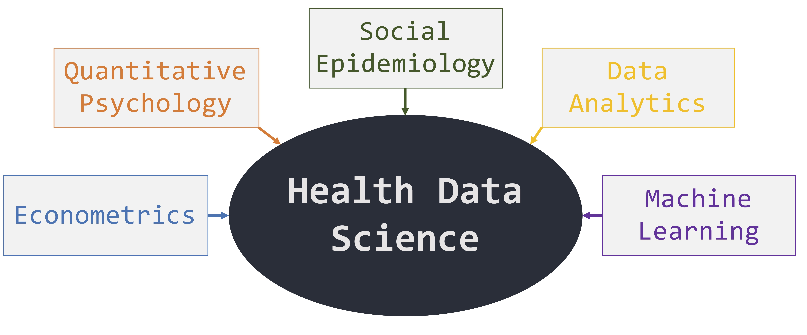

```{r setup, include=FALSE}
options(htmltools.dir.version = FALSE)
```

class: inverse, middle, center

# Any fool can know. The point is to understand.
### -- Albert Einstein --

---
class: inverse, middle, center

# The problem with quotes found on the internet is that they are often not true. 
### -- Abraham Lincoln --

---

.right[
# Prevention Science <br> + &nbsp;&nbsp;&nbsp;&nbsp; Data Science
]

-------

---
count: false

.right[
# Prevention Science <br> + &nbsp;&nbsp;&nbsp;&nbsp; Data Science

--------

.Huge[
The .dcoral[development] and .nicegreen[application] of advanced data analytic and statistical methods—including their software—in Prevention Science
]]


---
# Health Data Science

.pull-left[
.huge[
- .nicegreen[Pragmatic solutions] to research problems

- .dcoral[Broad applicability] across the Prevention Sciences
]]

.pull-right[
.huge[
- Focus is on .bluer[reproducibility and interpretability]

- Combines useful methods across multiple fields to .nicegreen[extract actionable information]
]]

---
# My Background and My Approach




---
# What I've Done So Far

<br>
.huge[

1. Providing methods and tools for prevention researchers

2. Applying advanced data analytic tools to childhood health research
]


---
class: inverse, center, middle
# Providing Methods and Tools

---
# Providing Methods and Tools

.huge[Two major aspects:]

.dcoral[
.pull-left[.center[
### Developing New Methods/Approaches

.large[Methods to make research more reproducible and interpretable]
]]]

--
.nicegreen[
.pull-right[.center[
### Creating Software in `R`

.pull-left[.large[
Makes working with data easier, reproducible, and more interpretable
]]

.pull-right[.large[
Provides the ability to use new methods
]]]]]

---
# Developing New Methods/Approaches

--
.Huge[The development of .dcoral[**Marginal Mediation Analysis**]]

--
.large[.large[
This is a synthesis of two powerful approaches:

1. .bluer[Mediation Analysis]

2. .nicegreen[Average Marginal Effects]
]]

---
# What is Mediation Analysis

.pull-left[
A series of regressions:

$$
Y = c_0 + b_1 M + c'_1 X + e_1
$$

$$
M = a_0 + a_1 X + e_2
$$

Used extensively in Prevention Science research (used somewhat in Epidemiology and Public Health)

- Provides info on the process of an effect
- Heavily based on theory and prior literature
]

.pull-right[
```{r, echo=FALSE, message=FALSE, warning=FALSE, fig.align='center', fig.height=4, fig.width=6}
library("lavaan")

# Example 5.8 from mplus user guide:
Data <- data.frame(
  Y = rnorm(100),
  X = rnorm(100),
  M = rnorm(100)
)

# Model:
model.Lavaan <- '
  M ~ X
  Y ~ M + X
'
fit <- cfa(model.Lavaan, data=Data, std.lv=TRUE)

# Plot path diagram:
library(semPlot)
semPaths(fit,
         title=FALSE, curvePivot = TRUE,
         edgeLabels = c("a", "b", "c'"),
         edge.label.cex = 2,
         layout = "spring",
         sizeMan = 12,
         shapeMan = "rectangle",
         border.color = "dodgerblue4",
         border.width = 3,
         node.width = 1.5,
         node.height = 1,
         mar = c(4,6,5,6))
```
]

--

```{r, message=FALSE, warning=FALSE, echo=FALSE}
library(tidyverse)
data.frame(
  Effects = c("Indirect Effect", "Direct Effect", "Total Effect"),
  Definitions = c("a * b", "c'", "a * b + c'")
) %>%
  DT::datatable(options = list(dom = "t"),
                rownames = FALSE,
                colnames = c("Effects of Interest", "Definitions"))
```

???
  - Series of regressions
  - Provides valuable information (when done properly)
  - Note the effects often sought after (indirect, direct, total)

But...

---
# But...

.large[
When the mediator or outcome is **categorical/non-normal**, mediation analysis lacks:

- intuitive interpretation (e.g., total effect doesn't equal total effect?)
- defined effect sizes (indirect or total) or meaningful confidence intervals
]
--

.large[**Why?**]


???
  - Mediation struggles with categorical/non-normal mediators/outcomes
  - For example, 
    - if X is continuous, M is binary, and Y is continuous the diagram shows how we would often model each path
    - So, how do you create a meaningful effect size when trying to combine logistic and linear regression?
  - Ultimately, to have any meaningful interpretation, **need additive**

So its not good. But to reiterate, consider the next slide.

---
# Why the big fuss?

.pull-left[
#### Linear Model

$$
Y = \beta_0 + \sum_j^p \beta_j X_j + e_i
$$

The marginal effect of, say, $X_1$ is:
$$
\frac{\delta Y}{\delta X_1} = \beta_1
$$
]

--

.pull-right[

#### Logistic Regression

$$
logit(Y) = \beta_0 + \sum_j^p \beta_j X_j + e_i
$$
$$
\frac{Prob(Y = 1)}{1 - Prob(Y = 1)} = e^{\beta_0 + \sum_j^p \beta_j X_j + e_i}
$$

$$
Prob(Y = 1) = \frac{e^{\beta_0 + \sum_j^p \beta_j X_j + e_i}}{1 + e^{\beta_0 + \sum_j^p \beta_j X_j + e_i}}
$$

The marginal effect of, say, $X_1$ is:
$$
\frac{\delta Y}{\delta X_1} = \frac{e^{\beta_0 + \sum_j^p \beta_j X_j + e_i}}{(1 + e^{\beta_0 + \sum_j^p \beta_j X_j + e_i})^2}
$$
]

???
  - Consider the *marginal effect* -- the thing you want in regression -- in two situations (**feel free to ignore the math**)
    - Linear
    - Logistic
      - In logistic the marginal effect depends on the values of all the predictors 
      - and it is just plain ugly compared to linear regression

The takeaway --> Marginal Effect depends on all covariates

Ultimately, mediation doesn't work well with categorical mediators/outcomes. But people are using those, right? So what are the common approaches?

---
# Current Approaches

```{r, echo=FALSE, message=FALSE, warning=FALSE}
data.frame(
  Number = 1:5,
  Approach = c("Series of logistic regressions",
               "Use SEM's approach (polychoric correlation)",
               "Standardize the coefficients",
               "Interpret each path separately",
               "Pretend all variables are continuous"),
  Pros = c("Simple to apply in most software", 
           "Powerful, well-designed,\nEasy to implement with proper software", 
           "Provides significance test\nof indirect effect",
           "Simplest approach with proper models",
           "Simplest approach"),
  Cons = c("Cannot obtain indirect effect size, only works with binary (M & Y)",
           "Only works with ordinal variables,\n only standardized effect sizes",
           "Assumptions (distributions), difficult to interpret beyond p-value",
           "Ignores some information,\n cannot obtain indirect effect size",
           "Purposeful mis-specification, poor model fit")
) %>%
  DT::datatable(options = list(dom = "t"),
                rownames = FALSE) %>%
  DT::formatStyle(c("Number"),
                  target = "row",
                  color = DT::styleEqual(c("1", 
                                           "2", 
                                           "3", 
                                           "4",
                                           "5"), 
                                         c("black", "black", "white", "white", "white")))
```
---
count: false

# Current Approaches

```{r, echo=FALSE, message=FALSE, warning=FALSE}
data.frame(
  Number = 1:5,
  Approach = c("Series of logistic regressions",
               "Use SEM's approach (polychoric correlation)",
               "Standardize the coefficients",
               "Interpret each path separately",
               "Pretend all variables are continuous"),
  Pros = c("Simple to apply in most software", 
           "Powerful, well-designed,\nEasy to implement with proper software", 
           "Provides significance test\nof indirect effect",
           "Simplest approach with proper models",
           "Simplest approach"),
  Cons = c("Cannot obtain indirect effect size, only works with binary (M & Y)",
           "Only works with ordinal variables,\n only standardized effect sizes",
           "Assumptions (distributions), difficult to interpret beyond p-value",
           "Ignores some information,\n cannot obtain indirect effect size",
           "Purposeful mis-specification, poor model fit")
) %>%
  DT::datatable(options = list(dom = "t"),
                rownames = FALSE) %>%
  DT::formatStyle(c("Number"),
                  target = "row",
                  color = DT::styleEqual(c("1", 
                                           "2", 
                                           "3", 
                                           "4",
                                           "5"), 
                                         c("black", "black", "black", "black", "black")))
```

???
  - There are five common approaches, but we don't have time to talk about each
  - Ultimately, nothing great.

Luckily, there is a simple technique known as Average Marginal Effects.

---
# Average Marginal Effects

.large[
The *average* of the marginal effects for any type of GLM:
]

--

.pull-left[
#### Definition: Continuous Variable
$$
AME_k = \beta_k \frac{1}{n} \sum_i^n f(\beta x_i)
$$
where $f$ is the derivative of the estimate with respect to $x_i$, the $\beta x_i$ is the linear combination of the predictors, and $AME_k$ is the average marginal effect for the $kth$ variable. 
]

--

.pull-right[
#### Definition: Dummy Coded Variable
$$
AME_{k} = \frac{1}{n} \sum_i^n [ F(\beta x_i | x_i = 1) - F(\beta x_i | x_i = 0) ]
$$
where $F(\beta x_i | x_i = 1)$ is the predicted value of the $ith$ observation when the dummy variable equals one and $F(\beta x_i | x_i = 0)$ is the predicted value when the dummy value equals zero. 
]

--

<br>

.center[.large[.dcoral[EXAMPLE]]]


???
  - Simply, they are the average of the marginal effects
    - with the observed values in place (no crazy or impossible values)
    - without diving into the math here, both are taking the average effect of a one unit increase in the $kth$ variable
  - In other words, take the predicted value at some level of the predictor, then add one to the predictor and take the prediction again. The difference is the marginal effect.
  - In a paper I'm working on right now, it shows the AME is a consistent estimator of the underlying latent effect (probability, count, etc.)

---
# Marginal Mediation Analysis

.huge[*The synthesis of Mediation and Average Marginal Effects*]

--
.large[.large[
- .bluer[Essentially applies Average Marginal Effects for each regression that make up the complete mediation model]
- Uses .dcoral[bootstrapping] to understand uncertainty
- Created the .nicegreen[software] to perform Marginal Mediation Analysis (discussed later)]]

--
.large[.large[To test its .dcoral[accuracy] and .dcoral[power], I performed a Monte Carlo Simulation]]

---
# Monte Carlo Simulation

#### The "a" Path Population Model (.bluer[Binary] Mediator)
- where the $Prob(M = 1)$ is a latent continuous variable with a logistic relationship with the predictors
- the $e_i$ is normally distributed with $\mu = 0$ and $SD = 1$.
$$
Prob(M = 1)_i = a_0 + a_1 x_c + a_2 x_d + e_i
$$
The observed variable, $M_i$, is defined as follows: $M_i = 0$ if $Prob(M = 1) < .5$ and $M_i = 1$ otherwise.

---
# Monte Carlo Simulation

#### The "a" Path Population Model (.bluer[Count] Mediator)
- where the mediator $M$ is a Poisson-distributed variable
- the $e_i$ is normally distributed with $\mu = 0$ and $SD = 1$.
$$
M_i = a_0 + a_1 x_c + a_2 x_d + e_i
$$

--

#### The "b" and "c'" Path Population Model (for both the binary and count mediators)
$$
Y_i = b_0 + b_1 M_i + c'_1 x_c + c'_2 x_d + e_i
$$
where this $e_i$ also is normally distributed with $\mu = 0$ and $SD = 1$.

- $x_c$ is a continuous predictor
- $x_d$ is a dummy coded predictor

???
  - The known population model consist of a binary M and continuous (approx normal) outcome
  - A path has a latent probability variable that maps onto a discrete mediator
  - B and C path is essentially a multiple linear regression

---
# Monte Carlo Simulation

.huge[.dcoral[Conditions] Varied for the simulation:]

.large[.large[
- Varying sample size (50 - 1000)
- Varying effect size of each path (small, medium, large)
- Varying Mediator's distribution (binomial, poisson)
]]

--

.large[.large[Each condition will have 500 replications]]

???
  - The conditions tested will be broad for basic understanding of the method's behavior
  - Sample size: basic for what is needed for logistic
  - Effect sizes range from small to big
  - Next few (proportion and distribution) are because logistic is involved
  - Bootstrap size (hopefully 500 is sufficient)
  
Outcomes will be:

1. bias (i.e., is the mean of the estimates at the population mean?), 
2. power (i.e., how often does the null properly get rejected?), 
3. confidence interval coverage (i.e., does the confidence interval cover the proper interval?), and 
4. how closely $a \times b + c'$ is to $c$ (i.e., does the indirect plus the direct effect equal the total effect?)

---
# Simulation Results

## Indirect + Direct = Total
.huge[
Importantly, $a \times b + c' = c$ (within rounding error, even at low sample sizes)

This means: 

1. We can be more confident in the estimates
2. We can assess the indirect and direct effects as a proportion of the total effect.
]


---
background-image: url(sim_fig_acc.png)
background-position: 85% 90%
background-size: 800px

# Estimation <br> Consistency


---
background-image: url(sim_fig_power.png)
background-position: 50% 85%
background-size: 900px

# Statistical Power


???
Definitions:

Logistic (OR)
1. Small = 1.58
2. Medium = 3.44
3. Large = 6.73

Count
1. Small = 1.34
2. Medium = 1.82
3. Large = 3.01

---
background-image: url(sim_fig_ci.png)
background-position: 85% 90%
background-size: 750px

# CI Coverage


---
# Interpretation of Estimates

.footnote[Given the units of the estimates, meta-analytic comparisons across studies can be simplified as well.]

.pull-left[.large[
**Principle 1: The individual paths are interpreted based on the corresponding endogenous variable's original metric.**

**Principle 2: The indirect effect, as a combination of the a and b paths, are interpreted based on the outcome's original metric.**

**Principle 3: Both the direct and total effects are interpreted based on the outcome's original metric.**
]]

--

.pull-right[
```{r, echo=FALSE, message=FALSE, warning=FALSE, fig.align='center', fig.height=4, fig.width=6}
library("lavaan")

# Example 5.8 from mplus user guide:
Data <- data.frame(
  Y_count = rnorm(100),
  X_continuous = rnorm(100),
  M_binary = rnorm(100)
)

# Model:
model.Lavaan <- '
  M_binary ~ X_continuous
  Y_count ~ M_binary + X_continuous
'
fit <- cfa(model.Lavaan, data=Data, std.lv=TRUE)

# Plot path diagram:
library(semPlot)
semPaths(fit,
         title=FALSE, curvePivot = TRUE,
         edgeLabels = c("AME = 0.23", "AME = 1.5", "AME = 0.5"),
         edge.label.cex = 2,
         nodeLabels = list(expression("M (binary)"), expression("Y (count)"), expression("X (continuous)")),
         layout = "spring",
         sizeMan = 14,
         shapeMan = "rectangle",
         border.color = "dodgerblue4",
         border.width = 3,
         node.width = 1.75,
         node.height = 1,
         mar = c(4,6,5,6))
```
]


???
  - One of the main advantages
  - However, given the number of combination of variable types, it is best to consider some basic interpretation principles
  - Review principles and show meaning in figure
    1. So with M being binary, the AME is a Marginal Probability or Risk
      - A one unit increase in X is associated with a .23 increase in the risk of M.
    2. In other words, it is the effect of X on Y through M (it should be in the outcomes units)
      - A one unit increase in X is associated with a `0.23 * 1.5 = 0.345` increase in the count of Y.
    3. No big surprises here since these are essentially the regression.

---
# Assumptions of the Approach

.left-column[
</br></br>
#### The same assumptions as linear models or generalized linear models hold.

</br></br></br>
.coral[#### Only additional assumption with AME:]
]

--

.right-column[
1. Correct distribution (normal in linear models)

1. Proper variance (homoskedastic in linear models)

1. Linear in parameters

1. Random sample

1. No measurement error

1. No omitted influences


### Marginal effect can be described *additively* (after accounting for all the covariates)
]

???
  - all same assumptions
  - Only additional one -- additively


---
# Creating Software

### In `R` and `Shiny`

.pull-left[.large[
Makes working with data easier, reproducible, and more interpretable
]]

.pull-right[.large[
Provides the ability to use new methods
]]

--
.center[
### .dcoral[Two of my software packages:]
.large[
The `furniture` R package

The `MarginalMediation` R package
]]

---
# `furniture`

.large[
Table 1 (The usual "Table 1" in publications)]

.pull-left[
```{r, eval=FALSE, message=FALSE}
library(furniture)
table1(nhanes,
       Age, GeneralHealth, Sex, Cancer, Asthma,
       splitby = ~Overweight,
       output = "latex2",
       test = TRUE)
```

]

.pull-right[

]

---
# `furniture`

.large[
Table C (for Correlation)]

```{r, eval=FALSE, message=FALSE}
library(furniture)
tableC(nhanes,
       Age, ModeActivity, VigActivity, Meals,
       output = "latex2",
       type = "pearson")
```


---
background-image: url(RJournal_snapshot.png)
background-position: 50% 75%
background-size: 950px

# `furniture`

.large[R Journal paper introducing the software and discusses the benefits to using a .dcoral[reproducible approach to making tables]]

---
# `MarginalMediation`

.large[.large[
New package to use Marginal Mediation Analysis
]]

```{r, echo=FALSE, message=FALSE}
library(furniture)
```
```{r, message=FALSE, warning=FALSE, results='hide'}
library(MarginalMediation)

pathbc = glm(marijuana ~ home_meals + gender + age + asthma, data = nhanes_2010, family = "binomial")
patha1 = glm(home_meals ~ gender + age + asthma, data = nhanes_2010, family = "poisson")
patha2 = glm(age ~ gender + asthma, data = nhanes_2010, family = "poisson")

fit = mma(pathbc,
          patha1,
          patha2,
          ind_effects = c("genderFemale-home_meals",
                          "age-home_meals",
                          "asthmaNo-home_meals",
                          "genderFemale-age",
                          "asthmaNo-age"),
          boot = 500)
```

---

```{r, echo=FALSE, comment = "              "}
fit
```


---
class: inverse, center, middle
count: false
# Childhood and Adolescent Health

---
# Childhood and Adolescent Health

.huge[.dcoral[
Let's discuss two of my recent projects in this area:]

- Childhood and Adolescent Hearing Loss

- Adolescent Religiosity and Substance Use
]

---
# Childhood and Adolescent Health

.huge[.dcoral[
Let's discuss two of my recent projects in this area:]

- Childhood and Adolescent Hearing Loss

- .whiteish[Adolescent Religiosity and Substance Use]
]

---
# Childhood and Adolescent Hearing Loss

.pull-left[
.dcoral[.Huge[Ground Level Research]
.huge[
1. Prevalence
2. Temporal Trends
3. Measurement
]]]

--

.pull-right[
.bluer[.Huge[Higher Level Research]
.huge[
4. Policy
5. Practice
]]]

???
I want to talk about one of the projects that addressed the prevalence and trends of adolescent hearing loss

---
# Childhood Hearing Loss: Prevalence and Trends

.large[.large[
Shargorodsky et al. (2010): .dcoral[adolescent hearing loss is] ⬆️ 
]]

.large[.large[
Serious **implications** for Healthcare:
]]

--
.large[.large[
1. Need to **investigate the cause** (iPods to blame?)
2. Need to **adjust care** (ask more about hearing in regular visits?)
3. Need to make **new policies** to curb trend (reduce volume levels on iPods?)
]]

--
.large[.large[.dcoral[But...] Conclusions only based on two time points]]


---
# NHANES

.huge[
The large, nationally-representative health survey now has .dcoral[4 time points available].]

.large[.large[Using `R` with the `survey` package, I replicated Shargorodsky's study but included the two additional time points]]

---
background-image: url(Figure1_Final.jpg)
background-position: 50% 70%
background-size: 900px

???
This figure shows the prevalence per 1000 adolescents across hearing loss level and laterality of the loss. 
There does look to be an increase with a precipitous drop in 2010. 
Ultimately, we can't conclude it is increasing.
Models suggested differences between 1994 and 2008 were common across combinations of degree and laterality.
But no differences between 1994 and 2010.
Is it due to sampling??
We need more data but NHANES stopped collecting this data in 2010
Ultimately, however, adolescent hearing loss is still an important public health risk (3 - 5% of kids)

Now we are going to switch gears a bit and discuss how I'm helping researchers help individuals


---
# Childhood and Adolescent Health

.huge[.dcoral[
Let's discuss two of my recent projects in this area:]

- .whiteish[Childhood and Adolescent Hearing Loss]

- Adolescent Religiosity and Substance Use
]
---
# Adolescent Religiosity and Substance Use

.large[.large[
Replication of Ford and Hill (2012) that used categorical mediators and outcomes

1. Demonstrates the use of Marginal Mediation Analysis
2. Demonstrates the interpretability increase in using MMA over the (good) approach of Ford and Hill
3. Highlights important (potentially) causal pathways leading to substance use
]]


---
background-image: url(fig_relig_sa.jpg)
background-position: 50% 85%
background-size: 800px


```{r, eval=FALSE, echo=FALSE}
library(MarginalMediation)
library(tidyverse)

load(file = "~/Dropbox/1 Dissertation/Manuscript_MM/Data/NSDUH_2014_Results.rda")

directs_un = list(fit_tob, fit_rx, fit_mar, fit_ill) %>%
  map(~.x$dir_effects) %>%
  do.call("rbind", .) %>%
  data.frame(.) %>%
  select(Direct, Lower, Upper) %>%
  data.frame(., row.names = gsub("religious", "Religiousity (Direct)", row.names(.))) %>%
  rownames_to_column() %>%
  mutate(Outcome = c(rep("Tobacco", 1), rep("Prescription", 1),
                     rep("Marijuana", 1), rep("Illicit", 1))) %>%  
  select(Outcome, rowname, Direct, Lower, Upper) %>%
  set_names(c("Outcome", "Path", "Indirect", "Lower", "Upper")) %>%
  mutate(CI = paste0("(", round(Lower,4), ", ", round(Upper,4), ")")) %>%
  select(-CI) %>%
  mutate(type = "Unadjusted")
directs_adj = list(fit_tob2, fit_rx2, fit_mar2, fit_ill2) %>%
  map(~.x$dir_effects) %>%
  do.call("rbind", .) %>%
  data.frame(.) %>%
  select(Direct, Lower, Upper) %>%
  data.frame(., row.names = gsub("religious", "Religiousity (Direct)", row.names(.))) %>%
  rownames_to_column() %>%
  mutate(Outcome = c(rep("Tobacco", 1), rep("Prescription", 1),
                     rep("Marijuana", 1), rep("Illicit", 1))) %>%  
  select(Outcome, rowname, Direct, Lower, Upper) %>%
  set_names(c("Outcome", "Path", "Indirect", "Lower", "Upper")) %>%
  mutate(CI = paste0("(", round(Lower,4), ", ", round(Upper,4), ")")) %>%
  select(-CI) %>%
  mutate(type = "Adjusted")
  
  
unadjusted = list(fit_tob, fit_rx, fit_mar, fit_ill) %>%
  map(~.x$ind_effects) %>%
  do.call("rbind", .) %>%
  data.frame(.) %>%
  select(Indirect, Lower, Upper) %>%
  data.frame(., row.names = gsub("religious-", "Religiousity Through", row.names(.))) %>%
  data.frame(., row.names = gsub("dep", "\nDepression", row.names(.))) %>%
  data.frame(., row.names = gsub("self", "\nRespondent Views", row.names(.))) %>%
  data.frame(., row.names = gsub("peer", "\nPeer Views", row.names(.))) %>%
  rownames_to_column() %>%
  mutate(Outcome = c(rep("Tobacco", 3), rep("Prescription", 3),
                     rep("Marijuana", 3), rep("Illicit", 3))) %>%
  select(Outcome, rowname, Indirect, Lower, Upper) %>%
  set_names(c("Outcome", "Path", "Indirect", "Lower", "Upper")) %>%
  mutate(CI = paste0("(", round(Lower,4), ", ", round(Upper,4), ")")) %>%
  select(-CI) %>%
  mutate(type = "Unadjusted") %>%
  rbind(., directs_un)

adjusted = list(fit_tob2, fit_rx2, fit_mar2, fit_ill2) %>%
  map(~.x$ind_effects) %>%
  do.call("rbind", .) %>%
  data.frame(.) %>%
  select(Indirect, Lower, Upper) %>%
  data.frame(., row.names = gsub("religious-", "Religiousity Through", row.names(.))) %>%
  data.frame(., row.names = gsub("dep", "\nDepression", row.names(.))) %>%
  data.frame(., row.names = gsub("self", "\nRespondent Views", row.names(.))) %>%
  data.frame(., row.names = gsub("peer", "\nPeer Views", row.names(.))) %>%
  rownames_to_column() %>%
  mutate(Outcome = c(rep("Tobacco", 3), rep("Prescription", 3),
                     rep("Marijuana", 3), rep("Illicit", 3))) %>%
  select(Outcome, rowname, Indirect, Lower, Upper) %>%
  set_names(c("Outcome", "Path", "Indirect", "Lower", "Upper")) %>%
  mutate(CI = paste0("(", round(Lower,4), ", ", round(Upper,4), ")")) %>%
  select(-CI) %>%
  mutate(type = "Adjusted") %>%
  rbind(., directs_adj)

inds = rbind(unadjusted, adjusted) %>%
  data.frame %>%
  mutate(type = factor(type, levels = c("Unadjusted", "Adjusted"))) %>%
  mutate(Path = gsub("[0-9]","", Path)) %>%
  mutate(Outcome = factor(Outcome, levels = c("Tobacco", "Prescription",
                                              "Marijuana", "Illicit")))

p = position_dodge(width = .2)
ggplot(inds, aes(Path, Indirect, group = type, color = type)) +
  geom_hline(yintercept = 0, color = "darkgrey") +
  geom_point(position = p, alpha = .8) +
  geom_errorbar(aes(ymin = Lower, ymax = Upper),
                position = p, alpha = .8) +
  facet_wrap(~Outcome) +
  coord_flip() +
  anteo::theme_anteo_wh() +
  theme(legend.position = "bottom",
        axis.line = element_line(color = "darkgrey"),
        panel.spacing = unit(.3, "in")) +
  scale_color_manual(values = c("chartreuse4", "coral2")) +
  labs(x = "", y = "",
       color = "")
ggsave(file = "docs/fig_relig_sa.jpg", height = 7, width = 9, units = "in")
```


---
# Adolescent Religiosity and Substance Use
### Proportion of Effect that is Mediated

```{r, echo=FALSE}
load(file = "~/Dropbox/1 Dissertation/Manuscript_MM/Data/NSDUH_2014_Results.rda")

tob_perc = fit_tob$ind_effects[,3]/(fit_tob$dir_effects[,1] + sum(fit_tob$ind_effects[,3]))
rx_perc  = fit_rx$ind_effects[,3]/(fit_rx$dir_effects[,1] + sum(fit_rx$ind_effects[,3]))
mar_perc = fit_mar$ind_effects[,3]/(fit_mar$dir_effects[,1] + sum(fit_mar$ind_effects[,3]))
ill_perc = fit_ill$ind_effects[,3]/(fit_ill$dir_effects[,1] + sum(fit_ill$ind_effects[,3]))

cbind(tob_perc, rx_perc, mar_perc, ill_perc) %>%
  data.frame %>%
  set_names(c("Tobacco", "Prescription", "Marijuana", "Illicit")) %>%
  map_df(~.x*100) %>%
  mutate(Mediator = c("Respondent Views", "Peer Views", "Depression")) %>%
  select(Mediator, Tobacco, Prescription, Marijuana, Illicit) %>%
  map_if(is.numeric, round, 1) %>%
  data.frame %>%
  DT::datatable(options = list(dom = "t"))
```


---
class: inverse, middle, center

# Future Directions

---
# Future Directions

.pull-left[.large[.large[
### Continue:

- My work with Marginal Mediation Analysis

- Software development that helps researchers

]]]

--

.pull-right[.large[.large[
### Increase:

- My methodological work regarding Mixture Modeling (with Dr. Bethany Bray)

- My research line regarding childhood substance use (with Dr. Jenn Maggs)

]]]


---
# Conclusions

.huge[
Ultimately, my work is based on .dcoral[**increasing understanding and interpretability**] through:

1. Method and tool development
2. Prevention research
]


---
class: inverse, center, middle

# Thank you.


